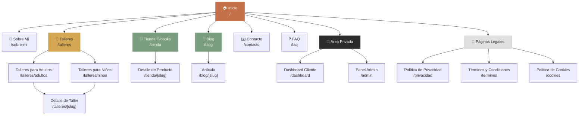
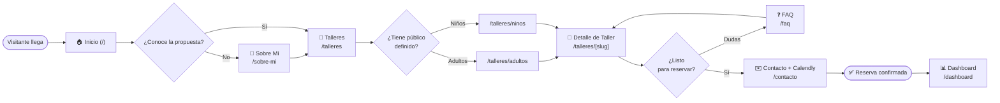
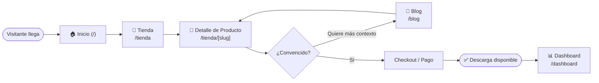
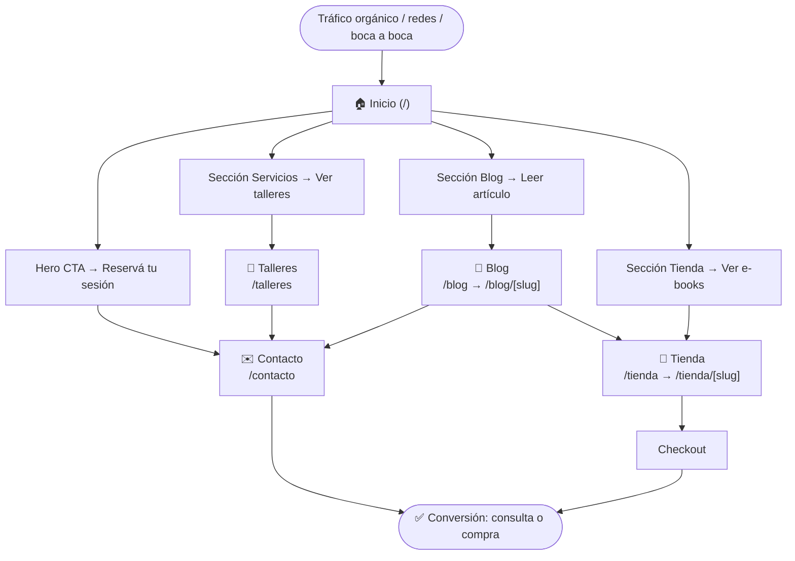

# Sitemap — ArteterapiaFlow

> Documento de arquitectura de información y estrategia UX/SEO.  
> Versión 1.0 · Abril 2026

---

## 1. Mapa visual del sitio

---

## 2. Tabla detallada de páginas

| Página | Ruta URL | Propósito | Usuario objetivo | Prioridad SEO |
|--------|----------|-----------|-----------------|:-------------:|
| **Inicio** | `/` | Landing principal: presentar la propuesta de valor, captar leads y derivar a conversión | Visitante nuevo, cualquier perfil | ⭐⭐⭐⭐⭐ |
| **Sobre Mí** | `/sobre-mi` | Generar confianza presentando a Paz: formación, enfoque y valores | Visitante que evalúa si contratar | ⭐⭐⭐⭐ |
| **Talleres (hub)** | `/talleres` | Página paraguas que organiza la oferta de talleres por público | Visitante interesado en talleres | ⭐⭐⭐⭐ |
| **Talleres para Adultos** | `/talleres/adultos` | Catálogo de talleres dirigidos a adultos con filtros por modalidad y fecha | Adultos buscando experiencia creativa o terapéutica | ⭐⭐⭐⭐⭐ |
| **Talleres para Niños** | `/talleres/ninos` | Catálogo de talleres para niños, con info sobre enfoque lúdico y edades | Padres/madres buscando actividades para sus hijos | ⭐⭐⭐⭐⭐ |
| **Detalle de Taller** | `/talleres/[slug]` | Página completa de cada taller: descripción, fechas, cupos, precio y reserva | Usuario listo para reservar | ⭐⭐⭐⭐ |
| **Tienda E-books** | `/tienda` | Catálogo de productos digitales descargables | Usuario que busca recursos de arteterapia para uso propio | ⭐⭐⭐⭐ |
| **Detalle de Producto** | `/tienda/[slug]` | Página de cada e-book: preview, índice, precio y botón de compra | Usuario listo para comprar | ⭐⭐⭐ |
| **Blog** | `/blog` | Listado de artículos sobre arteterapia, creatividad y bienestar | Visitante en fase de descubrimiento; tráfico orgánico | ⭐⭐⭐⭐⭐ |
| **Artículo del Blog** | `/blog/[slug]` | Contenido educativo individual con CTA hacia talleres o contacto | Lector que busca información específica | ⭐⭐⭐⭐ |
| **Contacto** | `/contacto` | Formulario de contacto + Calendly inline para agendar primera consulta | Usuario listo para dar el primer paso | ⭐⭐⭐ |
| **FAQ** | `/faq` | Respuestas a preguntas frecuentes para reducir fricción y objeciones | Visitante indeciso | ⭐⭐⭐ |
| **Dashboard Cliente** | `/dashboard` | Área privada: historial de talleres, materiales descargados, próximas sesiones | Cliente registrado | ❌ (no indexar) |
| **Panel Admin** | `/admin` | Gestión interna: talleres, reservas, blog, productos, clientes | Paz (administradora) | ❌ (no indexar) |
| **Política de Privacidad** | `/privacidad` | Cumplimiento legal RGPD/normativa local | Cualquier usuario | ⭐ |
| **Términos y Condiciones** | `/terminos` | Condiciones de uso del sitio y servicios | Cualquier usuario | ⭐ |
| **Política de Cookies** | `/cookies` | Detalle de cookies usadas y opciones de consentimiento | Cualquier usuario | ⭐ |

---

## 3. Flujos de navegación principales

### 3a. Flujo de reserva de taller

### 3b. Flujo de compra de e-book

### 3c. Flujo desde Home hasta conversión

---

## 4. Jerarquía de navegación

### Menú principal (Navbar)

| Orden | Ítem | Ruta | Notas |
|:-----:|------|------|-------|
| 1 | Inicio | `/` | Solo en mobile; en desktop es el logo |
| 2 | Talleres | `/talleres` | Despliega submenu: Adultos / Niños |
| 3 | Tienda | `/tienda` | — |
| 4 | Blog | `/blog` | — |
| 5 | Sobre Mí | `/sobre-mi` | — |
| 6 | **Reservar** *(CTA)* | `/contacto` | Botón destacado en terracota |

### Footer

| Columna | Ítems |
|---------|-------|
| **ArteterapiaFlow** | Tagline + redes sociales |
| **Explorar** | Talleres para Adultos, Talleres para Niños, Tienda, Blog |
| **Información** | Sobre Mí, FAQ, Contacto |
| **Legal** | Política de Privacidad, Términos, Cookies |

### Solo accesibles por link directo (no en nav ni footer)

- `/talleres/[slug]` — se accede desde listado de talleres
- `/tienda/[slug]` — se accede desde listado de tienda
- `/blog/[slug]` — se accede desde listado del blog
- `/dashboard` — post-login, link en header cuando el usuario está autenticado
- `/admin` — acceso exclusivo para administradora, no público

---

## 5. Estrategia SEO por página

| Página | Keyword principal | Keywords secundarias | Intención de búsqueda |
|--------|-------------------|---------------------|-----------------------|
| `/` | `arteterapia Montevideo` | `arteterapeuta Uruguay`, `psicoterapia creativa` | Navegacional / Informacional |
| `/sobre-mi` | `arteterapeuta certificada Uruguay` | `Paz Moncalvo arteterapia`, `terapia a través del arte` | Navegacional |
| `/talleres` | `talleres de arteterapia` | `talleres creativos Montevideo`, `arte expresivo Uruguay` | Informacional / Transaccional |
| `/talleres/adultos` | `talleres arteterapia adultos Montevideo` | `taller arte para adultos Uruguay`, `expresión artística adultos` | Transaccional |
| `/talleres/ninos` | `talleres arteterapia niños Montevideo` | `arte terapéutico niños Uruguay`, `actividades creativas niños` | Transaccional |
| `/talleres/[slug]` | `[nombre del taller] arteterapia` | `taller [tema] Montevideo`, `cupos disponibles` | Transaccional |
| `/tienda` | `e-books arteterapia` | `recursos arteterapia descargables`, `guías psicología creativa` | Transaccional |
| `/tienda/[slug]` | `[nombre del e-book]` | `comprar ebook arteterapia`, `guía [tema]` | Transaccional |
| `/blog` | `arteterapia beneficios` | `blog arteterapia Uruguay`, `psicoterapia creativa artículos` | Informacional |
| `/blog/[slug]` | `[keyword del artículo]` | Long tail según tema del artículo | Informacional |
| `/contacto` | `sesión arteterapia Montevideo` | `reservar sesión arteterapeuta`, `primera consulta gratuita arteterapia` | Transaccional |
| `/faq` | `preguntas frecuentes arteterapia` | `qué es arteterapia`, `para qué sirve arteterapia` | Informacional |
| `/privacidad` | — | — | — |
| `/terminos` | — | — | — |
| `/cookies` | — | — | — |

### Notas SEO generales

- **`/dashboard` y `/admin`** deben incluir `<meta name="robots" content="noindex, nofollow">` y estar protegidas por autenticación.
- Las páginas dinámicas `[slug]` deben generar metadata dinámica con `generateMetadata()` de Next.js 14.
- Implementar **sitemap.xml** dinámico (`app/sitemap.ts`) que incluya todas las rutas estáticas y las dinámicas de talleres, tienda y blog.
- Implementar **robots.txt** que bloquee `/dashboard`, `/admin` y `/api`.
- Todas las páginas de contenido deben tener **Open Graph tags** para compartir en redes sociales.
